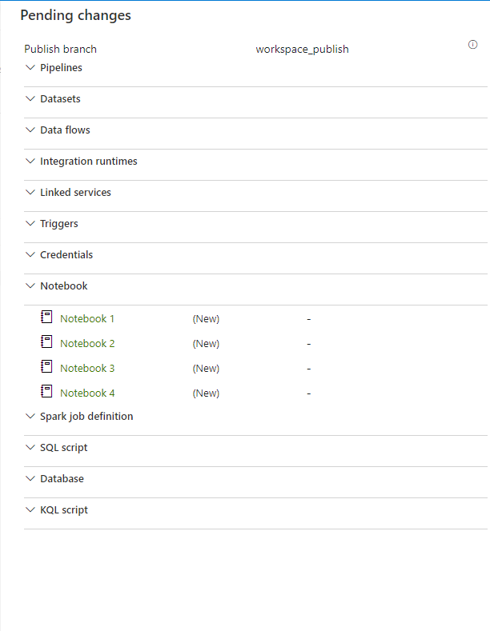

Synapse CI/CD Configuration with Github
=======================================

1.  CI/CD Workflow

2.  Dev Synapse git integration setup

CI/CD Workflow:

1.  Work on feature branch

2.  Test

3.  Integrate into collaboration branch through pull request

4.  Approve pull request and merge into collaboration branch (main or master)

5.  Push to QA environment using branch filter on workspace_publish

6.  Test in QA environment

7.  Approve moving to production

8.  Code moves into production

Collaboration branch –

Be sure that Import existing resources to repository is checked.

Working with Branches:
======================

In your working branch create a notebook.

Commit the change.

Note the change added a working branch

Merge pull request

Publishing 
===========

By default, Synapse Studio generates the workspace templates and saves them into
a branch called workspace_publish

Best Practices:
===============

-   **Permissions**. After you have a git repository connected to your
    workspace, anyone who can access to your git repo with any role in your
    workspace will be able to update artifacts, like sql script, notebook,spark
    job definition, dataset, dataflow and pipeline in git mode. Typically you
    don't want every team member to have permissions to update workspace. Only
    grant git repository permission to Synapse workspace artifact authors.

-   **Collaboration**. It's recommended to not allow direct check-ins to the
    collaboration branch. This restriction can help prevent bugs as every
    check-in will go through a pull request review process described
    in [Creating feature
    branches](https://docs.microsoft.com/en-us/azure/synapse-analytics/cicd/source-control#creating-feature-branches).

-   **Synapse live mode**. After publishing in git mode, all changes will be
    reflected in Synapse live mode. In Synapse live mode, publishing is
    disabled. And you can view, run artifacts in live mode if you have been
    granted the right permission.

-   **Edit artifacts in Studio**. Synapse studio is the only place you can
    enable workspace source control and sync changes to git automatically. Any
    change via SDK, PowerShell, will not be synced to git. We recommend you
    always edit artifact in Studio when git is enabled.

Setting up CI/CD Pipeline:

[Continuous integration & delivery in Azure Synapse Analytics - Azure Synapse
Analytics \| Microsoft
Docs](https://docs.microsoft.com/en-us/azure/synapse-analytics/cicd/continuous-integration-delivery)
